<div align="center">

### 🏧 ATM Simulator System
 
<hr>

<p>      </p>


</div>

<p align="center">

### 💳 A Desktop Banking Application Built with Java, Swing, JDBC & MySQL

*A feature-rich ATM simulation that recreates real-world banking operations through a modern Java desktop application while demonstrating Object-Oriented Programming, GUI development, JDBC connectivity, and relational database management.*

</p>

---

# 📚 Table of Contents

* 📖 Overview
* 🎯 Objectives
* ✨ Features
* 🏛️ System Architecture
* 🔄 Application Workflow
* 💻 Technology Stack
* 📊 Project Highlights

---

# 📖 Overview

The **ATM Simulator System** is a desktop-based banking application designed to simulate the working of a real Automated Teller Machine. The project aims to provide users with an intuitive interface for performing day-to-day banking operations while maintaining secure interaction with a backend relational database.

Developed using **Java**, **Swing**, **AWT**, **JDBC**, and **MySQL**, the application allows customers to authenticate themselves, manage their bank accounts, and perform transactions such as deposits, withdrawals, balance inquiries, PIN changes, and transaction history generation.

Unlike a simple CRUD application, this project closely follows the workflow of an actual ATM. Every user action is validated before being processed and stored within the database, ensuring data consistency and reliability. The application demonstrates how frontend components interact with backend services through JDBC, providing an excellent example of desktop application architecture.

The project also emphasizes software engineering best practices including modular programming, separation of concerns, exception handling, input validation, reusable components, and maintainable code structure.

---

# 🎯 Objectives

The primary goal of this project is to bridge theoretical computer science concepts with practical software development by implementing a complete banking simulation.

The project was developed to:

* Simulate the behavior of a real ATM system.
* Build an interactive desktop application using Java Swing.
* Integrate Java applications with MySQL databases through JDBC.
* Apply Object-Oriented Programming principles in a real-world project.
* Demonstrate transaction management and persistent data storage.
* Practice modular software development and clean architecture.
* Strengthen understanding of event-driven programming.

---

# ✨ Features

The ATM Simulator provides a complete banking experience through multiple integrated modules.

| 🔐 Authentication  | 💳 Banking        | 📄 Records          | ⚙️ Utilities     |
| ------------------ | ----------------- | ------------------- | ---------------- |
| Login              | Deposit           | Mini Statement      | PIN Change       |
| Signup             | Withdraw          | Transaction History | Fast Cash        |
| PIN Verification   | Balance Inquiry   | Database Storage    | Input Validation |
| Session Management | Cash Transactions | Persistent Records  | Error Handling   |

---

## 🌟 Core Functionalities

### 🔐 Secure Authentication

The application begins with a secure login system where users authenticate using their account credentials. New customers can register through a dedicated signup module, creating a new banking account that is immediately stored in the database.

---

### 💰 Deposit Money

Users can securely deposit money into their accounts. The application validates the entered amount before updating the balance in the MySQL database, ensuring consistency and preventing invalid transactions.

---

### 💸 Withdraw Money

The withdrawal module allows users to withdraw funds while checking for sufficient account balance. Every successful withdrawal is recorded in the transaction history.

---

### 📊 Balance Inquiry

Users can instantly view their current account balance, which is retrieved directly from the database in real time.

---

### 📄 Mini Statement

The mini statement feature displays recent transactions, providing users with a quick overview of deposits, withdrawals, and other account activities.

---

### 🔄 PIN Change

Customers can securely change their ATM PIN through the application, improving account security while ensuring proper authentication before updates are made.

---

# 🏛️ System Architecture

```text
                    +-------------------------+
                    |      User Interface     |
                    |   (Java Swing & AWT)    |
                    +-----------+-------------+
                                |
                                |
                                ▼
                    +-------------------------+
                    |   Application Logic     |
                    |     Java Classes        |
                    +-----------+-------------+
                                |
                                |
                                ▼
                    +-------------------------+
                    |      JDBC Driver        |
                    +-----------+-------------+
                                |
                                |
                                ▼
                    +-------------------------+
                    |     MySQL Database      |
                    +-------------------------+
```

The application follows a layered architecture where the graphical interface communicates with Java business logic. The business logic processes user requests and interacts with the MySQL database through JDBC, ensuring efficient data retrieval and storage.

---

# 🔄 Application Workflow

```text
Application Starts
        │
        ▼
 Login / Signup
        │
        ▼
User Authentication
        │
        ▼
ATM Dashboard
        │
 ┌──────┼───────────────┐
 │      │               │
 ▼      ▼               ▼
Deposit Withdraw   Balance Inquiry
 │      │               │
 └──────┼───────────────┘
        ▼
Database Update
        │
        ▼
Mini Statement
        │
        ▼
Logout
```

Each transaction performed by the user follows a structured workflow consisting of authentication, validation, processing, database synchronization, and confirmation. This approach ensures that every banking operation is executed reliably while maintaining data integrity.

---

# 💻 Technology Stack

| Technology       | Purpose                      |
| ---------------- | ---------------------------- |
| ☕ Java           | Core application development |
| 🎨 Swing         | GUI Design                   |
| 🖥️ AWT          | Event Handling & Components  |
| 🔌 JDBC          | Database Connectivity        |
| 🗄️ MySQL        | Data Storage                 |
| 💻 IntelliJ IDEA | Development Environment      |
| 📦 Git & GitHub  | Version Control              |

---

# 📊 Project Highlights

> [!NOTE]
> This project is more than a simple Java CRUD application. It demonstrates how desktop interfaces, business logic, and relational databases work together to build a realistic banking management system.

### ✅ Highlights

* 🏦 Realistic ATM Simulation
* 💻 Desktop-Based Banking Software
* 🔐 Secure Login & Authentication
* 💳 Complete Banking Operations
* 🗄️ Persistent MySQL Database
* ⚡ JDBC Integration
* 🧩 Modular Java Architecture
* 🛡️ Exception Handling
* 🎨 Interactive Swing GUI
* 📚 Object-Oriented Programming
* 📈 Scalable Codebase
* 🚀 Beginner-Friendly Yet Industry-Relevant

---

---

# ⚙️ Installation & Setup

Getting the ATM Simulator System up and running is straightforward. Follow the steps below to configure your development environment and launch the application locally.

## 📋 Prerequisites

Before running the project, ensure that the following software is installed on your system.

| Software                   | Recommended Version | Purpose                   |
| -------------------------- | ------------------: | ------------------------- |
| ☕ Java JDK                 |         17 or later | Compile & Run Application |
| 🗄️ MySQL Server           |                8.0+ | Database                  |
| 💻 IntelliJ IDEA / Eclipse |              Latest | IDE                       |
| 🌿 Git                     |              Latest | Version Control           |

---

## 📥 Clone the Repository

```bash
git clone https://github.com/YOUR_USERNAME/ATM-Simulator-System.git
cd ATM-Simulator-System
```

---

## 📦 Install Dependencies

Since this project is built using Java, ensure that the JDK is properly configured.

Verify Java installation:

```bash
java --version
```

---

## 🗄️ Configure MySQL

Create a database.

```sql
CREATE DATABASE atm;
USE atm;
```

Import your SQL tables if provided.

Open **Conn.java** and configure your database credentials.

```java
Connection connection = DriverManager.getConnection(
"jdbc:mysql://localhost:3306/atm",
"root",
"your_password"
);
```

---

## ▶️ Run the Application

Open the project inside IntelliJ IDEA.

Locate

```
Main.java
```

Click

```
Run ▶ Main.main()
```

The ATM Login Screen will appear.

---

# 🗄️ Database Design

The application follows a relational database model where all customer information and transaction history are stored securely inside MySQL.

Instead of storing temporary information inside memory, every banking operation updates the database immediately, ensuring persistence even after restarting the application.

---

## 🏦 Database Workflow

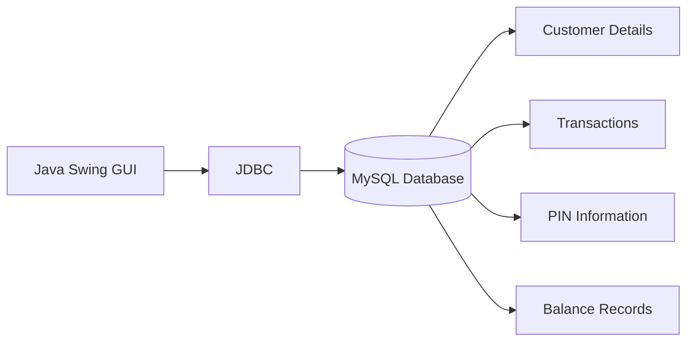

---

## 📊 Entity Relationship

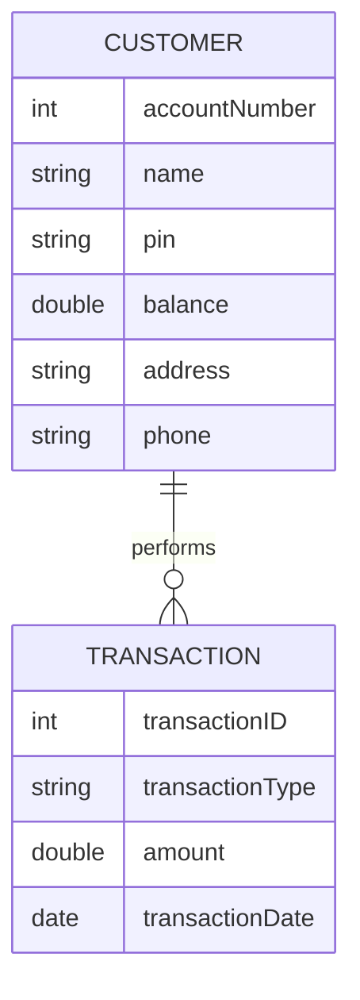

---

## 📂 Database Tables

### 👤 Customer Table

| Column         | Description               |
| -------------- | ------------------------- |
| Account Number | Unique Account Identifier |
| Name           | Customer Name             |
| PIN            | Authentication PIN        |
| Address        | Customer Address          |
| Phone          | Mobile Number             |
| Balance        | Current Account Balance   |

---

### 💳 Transaction Table

| Column         | Description          |
| -------------- | -------------------- |
| Transaction ID | Primary Key          |
| Account Number | Foreign Key          |
| Type           | Deposit / Withdrawal |
| Amount         | Transaction Amount   |
| Date           | Transaction Date     |
| Time           | Transaction Time     |

---

> [!TIP]
> Every transaction performed by the user is permanently recorded in the database, enabling Mini Statements and accurate Balance Inquiry.

---

# 🔐 Authentication Module

Authentication is the first layer of security implemented within the ATM Simulator System.

Every user must successfully authenticate before accessing banking services.

The login system verifies the entered account number and PIN against the records stored inside the MySQL database.

Only authenticated users can perform financial operations.

---
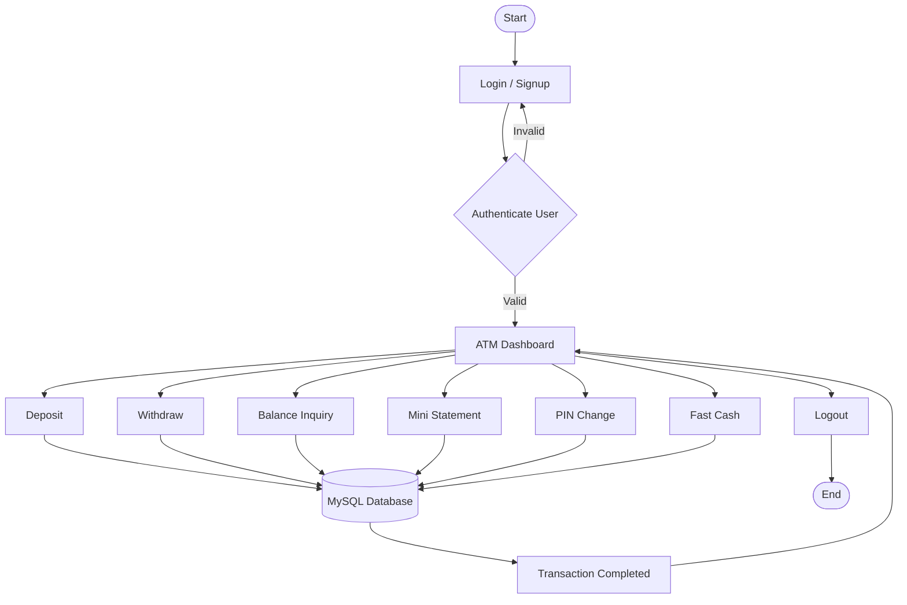
---

## 🔄Login Workflow


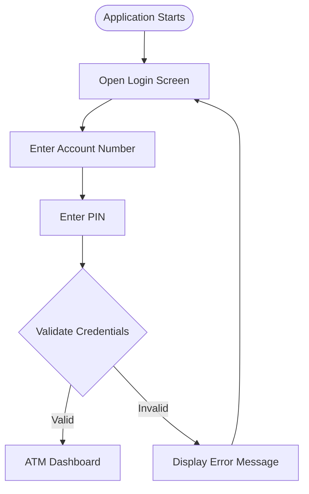
---

## 🛡️ Security Features

✔ Secure Login

✔ PIN Verification

✔ Invalid Credential Detection

✔ Session-Based Access

✔ Database Authentication

✔ Input Validation

✔ Error Handling

---

# 💳 Banking Modules

The application consists of multiple independent modules that work together to provide a seamless banking experience.

---

## 💰 Deposit Module

The Deposit Module enables customers to securely add money to their accounts.

After validating the entered amount, the system updates the balance inside the MySQL database and immediately records the transaction.

### Deposit Flow

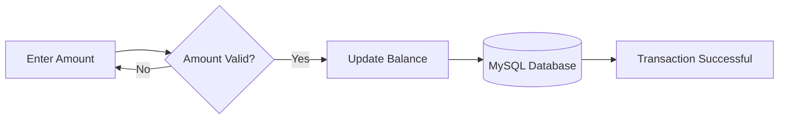

## 💸 Withdrawal Module

The Withdrawal Module allows users to withdraw cash while ensuring sufficient balance exists.

If the account balance is insufficient, the transaction is rejected.

Otherwise, both the balance and transaction history are updated.

### Withdrawal Flow


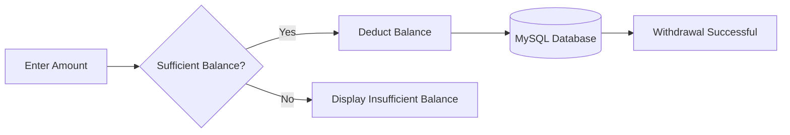

## 📄 Mini Statement

The Mini Statement Module retrieves recent transaction history directly from the database.

Each record contains

* Transaction Type
* Amount
* Date
* Time

This provides users with a quick summary of recent banking activity.

---
## 📄 Mini Statement

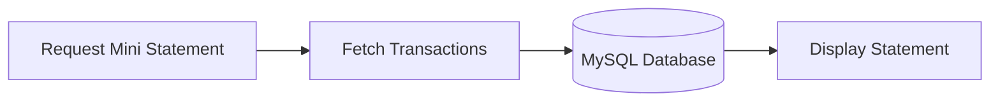
---

## 📊 Balance Inquiry

The Balance Inquiry module retrieves the latest account balance from the MySQL database without modifying any existing data.

Since the balance is fetched directly from the database, users always receive real-time information.

---

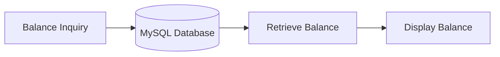
---


## 🔄 PIN Change

The PIN Change module allows authenticated users to update their ATM PIN securely.

Before changing the PIN, the application verifies the user's identity to prevent unauthorized access.

---

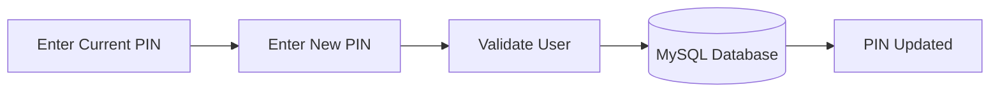
---

## ⚡ Fast Cash

The Fast Cash module provides predefined withdrawal options, allowing users to withdraw commonly used amounts instantly without manually entering values.

Example:

* ₹500
* ₹1000
* ₹2000
* ₹5000
* ₹10000

---

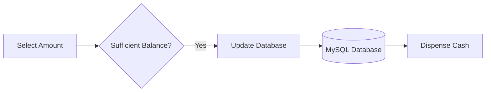
---

# 📈 Module Interaction

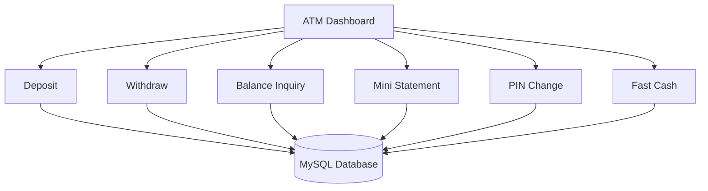

---

# 📊 Why JDBC?

JDBC acts as the communication bridge between Java and MySQL.

Instead of storing information temporarily within the application, JDBC allows every banking operation to interact directly with the database.

This enables:

* Real-Time Database Updates
* Secure Data Retrieval
* Persistent Storage
* Scalability
* Efficient Query Execution

---

---

# 🧠 Object-Oriented Programming Concepts

The ATM Simulator System has been designed following the principles of **Object-Oriented Programming (OOP)** to ensure modularity, maintainability, and scalability. Each functionality is encapsulated within dedicated classes, making the application easy to understand, debug, and extend.

| Principle         | Implementation                                                                                       |
| ----------------- | ---------------------------------------------------------------------------------------------------- |
| **Encapsulation** | Customer information, account details, and transaction logic are organized within dedicated classes. |
| **Abstraction**   | Complex database operations are hidden behind simple user interactions.                              |
| **Inheritance**   | Common behaviors can be extended for future banking modules.                                         |
| **Polymorphism**  | Methods can be expanded to support additional banking services with minimal code changes.            |

---

# 🏗️ Software Design Principles

The project follows a modular architecture where each module is responsible for a single task.

```text
Presentation Layer
        │
        ▼
Business Logic Layer
        │
        ▼
Database Connectivity (JDBC)
        │
        ▼
MySQL Database
```

This layered approach keeps the application organized and improves maintainability by separating user interface logic from database operations.

---

# 📊 Project Statistics

| Category                | Details                                                                   |
| ----------------------- | ------------------------------------------------------------------------- |
| 💻 Programming Language | Java                                                                      |
| 🎨 GUI Framework        | Swing & AWT                                                               |
| 🗄️ Database            | MySQL                                                                     |
| 🔌 Connectivity         | JDBC                                                                      |
| 🏗️ Architecture        | Desktop Application                                                       |
| 🔐 Authentication       | PIN-Based                                                                 |
| 📄 Transaction Records  | Persistent                                                                |
| 💳 Banking Services     | Deposit, Withdraw, Balance Inquiry, Mini Statement, PIN Change, Fast Cash |
| 💡 Development Paradigm | Object-Oriented Programming                                               |
| 📦 Version Control      | Git & GitHub                                                              |

---

# 🚀 Performance Highlights

The application has been developed with efficiency and simplicity in mind.

| Operation           | Expected Performance            |
| ------------------- | ------------------------------- |
| User Authentication | Fast database lookup            |
| Balance Inquiry     | Instant retrieval               |
| Deposit             | Immediate database update       |
| Withdrawal          | Real-time validation and update |
| Mini Statement      | Quick transaction retrieval     |
| PIN Change          | Secure database modification    |

> [!IMPORTANT]
> Database indexing and optimized SQL queries can further improve performance when handling larger datasets.

---

# 📚 Skills Demonstrated

This project demonstrates practical knowledge in the following areas:

* ☕ Java Programming
* 🎨 Java Swing Development
* 🖥️ Java AWT
* 🔌 JDBC Connectivity
* 🗄️ MySQL Database Management
* 📊 SQL Queries
* 🧠 Object-Oriented Programming
* 🧩 Event-Driven Programming
* ⚠️ Exception Handling
* ✅ Input Validation
* 🌿 Git & GitHub
* 💻 Desktop Application Development

---

# 🎯 Learning Outcomes

Developing the ATM Simulator System provided valuable practical experience in building a complete desktop application from scratch. It strengthened my understanding of Java programming by applying Object-Oriented Programming concepts to solve real-world problems.

The project also enhanced my knowledge of GUI development using Swing and AWT, while JDBC integration helped me understand how desktop applications communicate with relational databases. Working with MySQL improved my ability to design database schemas, write SQL queries, and manage persistent data efficiently.

Additionally, implementing banking operations such as authentication, deposits, withdrawals, and transaction history reinforced the importance of modular programming, validation, exception handling, and secure data management.

Overall, this project bridges the gap between academic concepts and practical software development by simulating a real-world banking environment.

---

# 🛣️ Future Roadmap

The current implementation focuses on core ATM functionalities. Future versions of the project may include several advanced features to make the system more realistic and production-ready.

| Status | Feature                                |
| ------ | -------------------------------------- |
| ✅      | Secure Login                           |
| ✅      | Signup                                 |
| ✅      | Deposit Money                          |
| ✅      | Withdraw Money                         |
| ✅      | Balance Inquiry                        |
| ✅      | Mini Statement                         |
| ✅      | Fast Cash                              |
| ✅      | PIN Change                             |
| 🔄     | Password Encryption (SHA-256 / BCrypt) |
| 🔄     | OTP Verification                       |
| 🔄     | Email Notifications                    |
| 🔄     | SMS Alerts                             |
| 🔄     | QR Code Payments                       |
| 🔄     | UPI Integration                        |
| 🔄     | Fund Transfer                          |
| 🔄     | PDF Account Statements                 |
| 🔄     | Admin Dashboard                        |
| 🔄     | Role-Based Access Control              |
| 🔄     | Biometric Authentication               |
| 🔄     | Cloud Database Deployment              |
| 🔄     | REST API Integration                   |
| 🔄     | Mobile Companion Application           |

---

# 💼 Why This Project?

Unlike a basic CRUD application, this project simulates a real banking workflow by integrating a desktop user interface with a relational database. It demonstrates how authentication, transaction processing, data persistence, and user interaction work together within a software system.

The project serves as a practical example of desktop application development and reflects an understanding of software architecture, database integration, and object-oriented design.

---

# 🤝 Contributing

Contributions are welcome and appreciated.

If you have ideas for improving the project, fixing bugs, or adding new features, feel free to contribute by following these steps:

1. Fork the repository.
2. Create a new feature branch.

```bash
git checkout -b feature/new-feature
```

3. Commit your changes.

```bash
git commit -m "Add new feature"
```

4. Push the branch.

```bash
git push origin feature/new-feature
```

5. Open a Pull Request.

Please ensure that your code follows clean coding practices and includes meaningful commit messages.

---

# 📜 License

This project is open-source and is available under the **MIT License**.

You are free to use, modify, and distribute this project in accordance with the terms of the license.

---

# 👨‍💻 Author

<div align="center">

## **Punya Prasoon Panda**

**Java Developer • Full Stack Enthusiast • Problem Solver**

📧 **[punyapanda2005@gmail.com](mailto:punyapanda2005@gmail.com)**

GitHub: **https://github.com/PCUBE2005**

LinkedIn: **https://www.linkedin.com/in/punya-prasoon-panda-717892319/**

</div>

---

# 🌟 Support

If you found this project useful or learned something from it, consider supporting it by giving the repository a **⭐ Star** on GitHub.

Your support helps improve the visibility of the project and motivates future development.

---

<div align="center">

## 💙 Thank You for Visiting!

**Built with ☕ Java, 🎨 Swing, 🖥️ AWT, 🔌 JDBC, and 🗄️ MySQL**

*"I create , to Live! ."*

⭐ **Don't forget to Star the Repository!** ⭐

</div>


